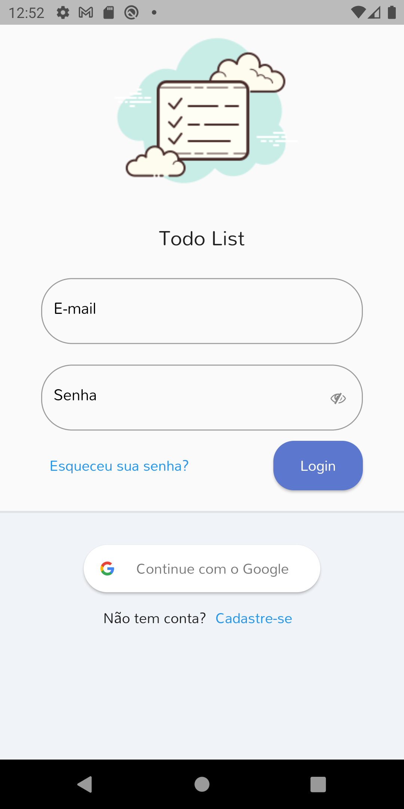
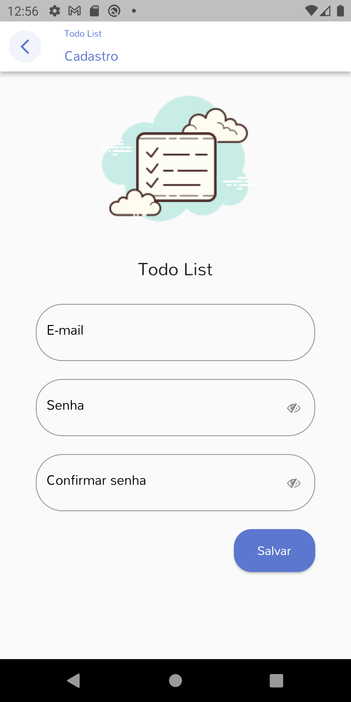
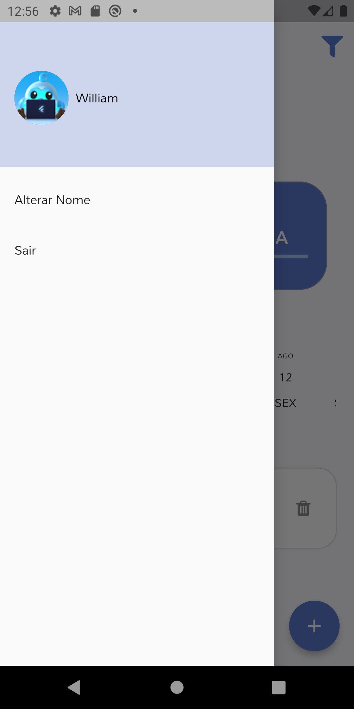
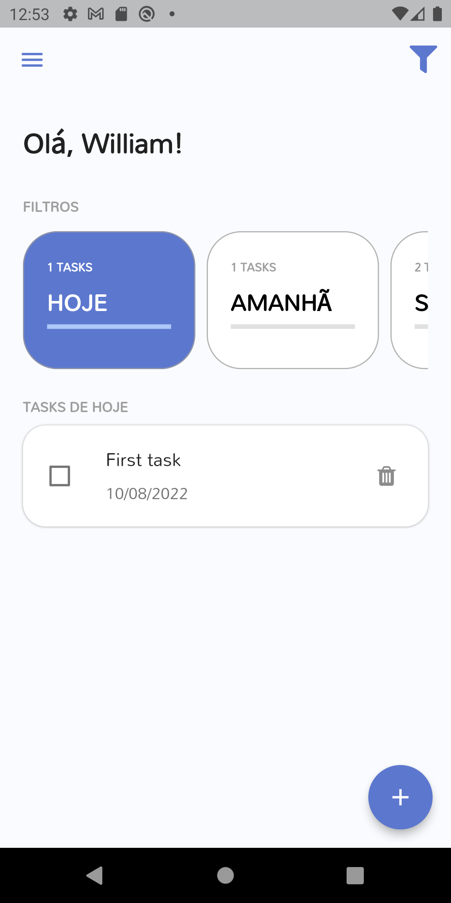
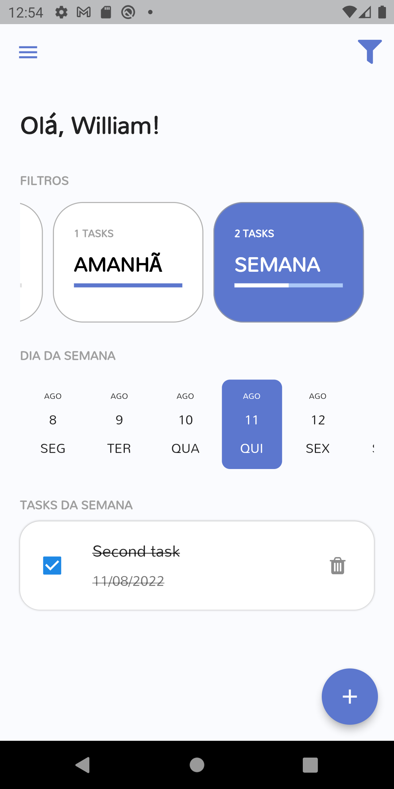
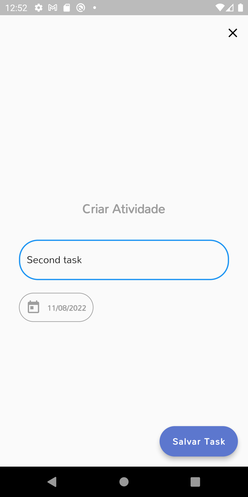

<h1 align="center">
  
</h1>

<p align="center">A simple Todo List app made with Flutter.</p>
<p align="center">💙</p>

<p align="center">
 <a href="#-screenshots">Screenshots</a> •
 <a href="#-firebase">Firebase</a> •
 <a href="#-running-the-app">Running the app</a> •
 <a href="#-technologies">Technologies</a> •
 <a href="#-others">Others</a>
</p>

---
## 📱 Screenshots

<br>
<h1 align="center">
  
  
  
</h1>
<h1 align="center">
  
  
  
</h1>

## 🔥 Firebase

```bash
# Configure the Firebase CLI and FlutterFire CLI
https://firebase.google.com/docs/flutter/setup?hl=pt-br&platform=android

# Create a Firebase project (you can use the Firebase console or de CLI)
# Execute the following command in your project folder to create a new Firebase project or to select an existing one
$ flutterfire configure

# Add the e-mail/password and the Google login options in the Firebase console

# Make sure you add your SHA1 to the Firebase project
# The following command will show your SHA1
$ keytool -list -v -keystore C:\Users\William\.android\debug.keystore -alias androiddebugkey -storepass android -keypass android
```

---

## 💻 Running the app

```bash
# Getting packages
$ flutter pub get

# Running
$ flutter run
```

---

## 🚀 Technologies
- [Dart](https://dart.dev/)
- [Flutter](https://flutter.dev/)
- [Provider](https://pub.dev/packages/provider)
- [Firebase](https://console.firebase.google.com/)
- [Sqflite](https://pub.dev/packages/sqflite)
- [Validatorless](https://pub.dev/packages/validatorless)
- [Intl](https://pub.dev/packages/intl)
- [Google Sign-In](https://pub.dev/packages/google_sign_in)

---

## 🛠️ Others
Project following the Conventional Commits specification: https://www.conventionalcommits.org/en/v1.0.0

---

<div align="center">

[](https://www.linkedin.com/in/williambarreiro/)

</div>
